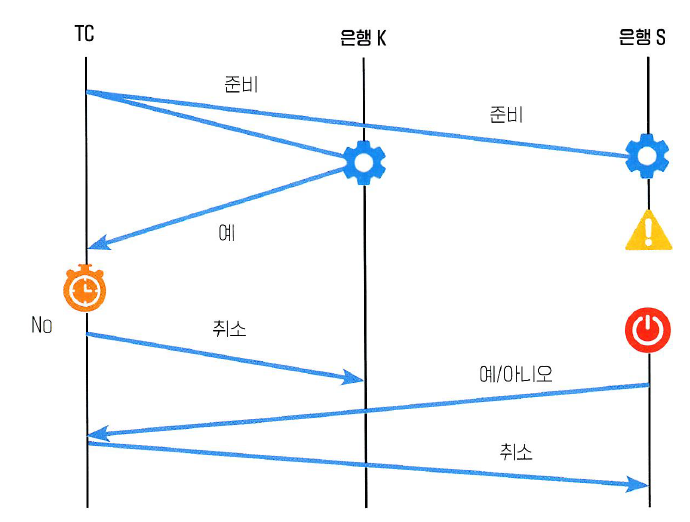

# 4주차

## **SAGA 패턴**

---

### 2PC의 한계

- 성능 저하: 모든 참여자가 커밋 또는 롤백을 완료할 때까지 기다려야 하기 때문에, 네트워크 지연이나 참여자 지연이 있을 경우 성능이 저하될 수 있다.
- 가용성 문제: 코디네이터가 장애를 일으키면 전체 트랜잭션이 대기 상태가 된다.
- 잠금 문제: 트랜잭션이 커밋되거나 롤백될 때까지 관련 자원들이 잠긴 상태로 유지되어야 하므로, 이로 인해 다른 작업이 지연될 수 있다.

### Saga Pattern

- 하나의 긴 트랜잭션을 독립적인 로컬 트랜잭션들의 연속으로 나누고 단계별로 즉시 커밋하여 2PC의 자원 잠금 문제를 해결
- 실패 시 보상 트랜잭션을 실행하는 방식으로 2PC의 성능 저하 및 가용성 문제 없이 최종 일관성을 보장

### Saga Pattern의 종류

Choreography Saga Pattern

중앙 제어 없이, 서비스끼리 이벤트로 통신하는 패턴

Orchestration Saga Pattern

중앙의 컨트롤러가 전체 흐름과 보상 작업을 제어하는 패턴

→ 계좌이체 등 복잡한 로직에서 사용

### 예시

1. S은행이 중앙 관리자에게 ‘예’ 보내기 전에 장애가 발생했지만, K은행은 ‘예’라고 메시지 보낸 경우

| **구분** | **2PC** | **Saga 패턴** |
| --- | --- | --- |
| **K은행의 상태** | TC가 S의 타임아웃을 감지하고 '취소' 명령을 줄 때까지, K은행은 데이터에 락을 걸고 기다려야 함 | K은행은 자신의 트랜잭션을 수행하고 즉시 커밋, 락을 잡고 기다리지 않음 → 2PC와 다르게 K은행은 다른 업무를 처리할 수 있음 |
| **장애 처리** |  TC에 S은행의 ‘예’ 메시지가 도착하지 않음 → 입금 작업 실패로 간주 → TC가 타임아웃 후 Rollback 결정하면, 그때서야 K은행도 락을 풀고 원상복구함 |  오케스트레이터에 S은행의 ‘예’ 메시지가 도착하지 않음 → 입금 작업 실패로 간주 → 보상 트랜잭션(결제 취소)을 실행하여 K은행의 작업을 취소 |

만약 S은행에 입금이 되었으나 이후 오케스트레이터에 ‘예’를 못 보낸 상황인 경우 → K은행 출금을 취소하면 시스템 전체에서 돈이 두 배로 복사되는 데이터 불일치 문제 상황이 발생할 수 있음 

ex) K은행 계좌 잔액 100만원, S은행 계좌 잔액 0원인 상황에서 K → S은행으로 100만원을 이체하는경우

1. K은행 출금 성공 (K: 잔액 100만원 → 0원)
2. S은행 입금 성공 (S: 잔액  0원 → 100만원)
3. ‘예’응답이 오지 않아 오케스트레이터는 S은행에 입금 실패한것으로 착각
4. K은행 보상 트랜잭션으로 환불 (K: 잔액 100만원, S: 잔액 100만원) → 총 200만원

해결법

오케스트레이터는 S은행이 입금을 했는지 알 방법이 없음

1. 오케스트레이터 → S은행에 무조건 입금 취소 명령
    - 혹시 S은행이 입금 한 후에 서비스 장애가 발생하여 ‘예’ 메시지가 도착하지 않은 경우를 고려하여 입금했으면 취소하라는 메시지를 S은행 큐에 전송
2. S은행의 멱등성 처리:
    - S은행이 재부팅 되어 큐를 확인했을 때 취소하라는 메시지가 있는지 확인
    - 입금한 적이 있다면 입금 취소
    - 입금한 적이 없다면 아무 행동 하지 않음