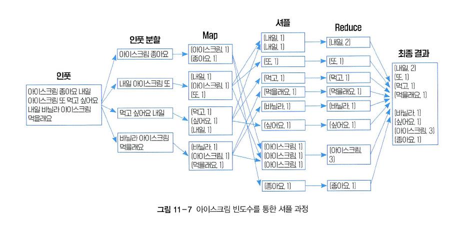

# 6주차

맵리듀스 기반 병렬 처리

맵리듀스: 대용량의 데이터를 효율적으로 처리하기 위한 병렬 프로그래밍 모델 및 처리 방식. 주로 분산 처리 환경에서 사용됨, 크게 Map과 Reduce 단계로 구성됨

Map: 입력된 데이터를 분할하고, 매핑하여 가공하는 단계

Reduce: Map으로 가공된 데이터의 중복을 제거하고 축소하는 역할

- **인풋 분할**
    - 데이터를 일정 크기로 분할한 뒤, 작업 노드에 전달하는 과정이다.
- **맵핑**
    - 분할 된 데이터에 mapping 함수가 적용하는 과정이다.
    - 예시에는 분할된 데이터에서 각 단어의 빈도수가 <key, value>의 형태로 나오게 된다.
- **셔플**
    - 맵핑 단계에서 발생한 중간 데이터에 대해서 Reducing을 하기 위해서 정렬하고 그룹화하는 과정이다.
    - 분할 및 맵핑 이후로 동일한 키들이 다른 작업 노드에 위치하고 있기에 동일한 키를 갖는 중간 데이터를 같은 리듀스 태스크로 전송하기 위함이다.
- **리듀싱**
    - 처리된 데이터를 집계하고, 결과물을 내보내는 과정이다.
    - 예시에는 셔플링을 통해 그룹화 된 맵핑 과정을 거친 단어의 빈도수 <key, value>를 최종적으로 카운트하여 단어별 총 빈도수 결과를 생성하였다.

**Shuffle** 단계 전체 메커니즘

**Map Side**

1. Map 실행: 입력 데이터를 쪼개 Map 태스크가 처리
2. 메모리 버퍼 저장: Map의 출력값을 즉시 디스크에 쓰지 않고, 메모리 버퍼에 먼저 저장
    - Reduce로 전달되기 좋게 미리 파티션 내부에서 key를 기준으로 퀵 소트를 수행하여 정렬함
3. Spill: 버퍼의 일정 비율이 차면 정렬된 데이터를 디스크에 쓴다. 데이터가 메모리보다 클 때 시스템이 멈추지 않도록 디스크를 임시 저장소로 활용하는 것
4. Merge: 만들어진 여러 개의 Spill 파일들을 하나의 파일로 합친다, 이 과정에서 Merge sort 알고리즘이 사용됨 (이미 정렬된 파일들을 합치는 작업이기 때문)
    - 이 모든 과정은 Map 태스크가 있는 로컬 환경에서 수행되어 빠름

**Reduce Side**

1. Copy: Reducer가 네트워크를 통해 자신에게 해당되는 데이터를 Map 노드로부터 가져옴.
2. Buffer & Spill: 가져온 데이터를 자신의 로컬 메모리 버퍼에 저장하다가, 꽉 차면 다시 디스크로 Spill함
3. Final Merge: Map 쪽과 마찬가지로 여러 조각의 파일들을 병합하여 최종적으로 Reduce 함수에 입력으로 넣음. 병합된 데이터에서 같은 Key를 가진 Value들을 묶는 과정
- Key가 바뀔 때마다 reduce() 함수를 호출
- 입력: {Key1, Val1}, {Key1, Val2}, {Key2, Val3}…
- 함수 호출: reduce(Key1, [Val1, Val2]), reduce(Key2, [Val3])