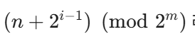

# 7주차

## Chord 알고리즘

### 1. Chord 알고리즘과 핑거 테이블의 필요성

- 중앙 디렉토리 서버를 두는 경우 해당 서버 고장 시 Single-Point of Failure가 발생
- 중앙 서버를 없애고 인접한 데이터 서버끼리 징검다리식으로 하나씩 일일이 데이터 유무를 묻는 방식은 시간이 너무 오래 걸림
- 중앙 서버를 두지 않으면서 검색 속도를 높이기 위해, 각 데이터 서버는 '핑거 테이블'이라는 이웃 서버 주소록을 가짐 → 서버를 하나씩 순차적으로 거치지 않고, 크게 크게 건너뛰면서 원하는 데이터에 빠르게 근접할 수 있음

### 2. 이웃 노드 구하는 공식

- n: 현재 서버의 ID
- i: 라우팅 테이블 엔트리 ID
- m: 라우팅 엔트리 수

### 3. 탐색 과정 예시

ID=2 : 이웃 서버 ID 3, 5, 8  ID=8 서버: 이웃 서버 ID 10, 21, 77

1. 사용자가 현재 ID=2인 서버에 접속하여 K=13인 데이터를 찾으려 함
2. ID=2의 핑거 테이블에 있는 이웃 서버들을 확인해 보더라도, 그 이웃들이 K=13 데이터를 직접 보관하고 있을 확률은 낮다
    - 일관적 해싱에서는 데이터가 자신의 값보다 크거나 같은 첫 번째 서버에 저장되는데, K=13이라는 값은 현재 서버(ID=2)와 핑거 테이블에 있는 이웃 서버들( ID 3, 5, 8)의 범위를 벗어나기 때문
3. ID=2 서버의 핑거 테이블에는 이웃 서버 ID 3, 5, 8의 정보가 있음
4. 찾고자 하는 키값(K=13)보다 작으면서 가장 큰 ID를 가진 이웃에게 요청을 넘김, 즉 3, 5, 8 중에서 13보다 작으면서 가장 큰 값은 **8**이므로, 3과 5를 거치지 않고 바로 **I**D=8 서버로 요청을 건너뛰어 보냄
    - 찾고자 하는 키값보다 작으면서 가장 큰 ID를 가진 이웃에게 요청을 넘기는 이유
        
        1. ‘13보다 작은' ID를 찾는 이유
        
        - 만약 탐색을 진행하다가 13보다 큰 서버로 점프해 버리면, 실제 데이터를 보관하고 있는 서버를 지나쳐 버리는 문제가 발생할 수 있음
        
        2. 그중에서 '가장 큰' ID를 고르는 이유
        
        - 13보다 작은 서버 내에서는 목표값에 가장 가까운 서버로 넘겨야 탐색 횟수와 시간을 최소화할 수 있음  → 가장 큰 도약이 가능한 ID=8 서버로 요청을 전달
5. 요청을 넘겨받은 ID=8 서버는 자신의 이웃 정보를 확인하고. 10, 21, 77이므로 일관적 해싱의 규칙에 따라 10초과 ~ 21 이하의 범위를 담당하는 ID=21서버에 K=13데이터가 보관되어있음을 바로 알 수 있음
6. ID=8 서버가 ID=21 서버에게 데이터를 받아와, 처음 문의했던 ID=2 서버에게 최종적으로 전달